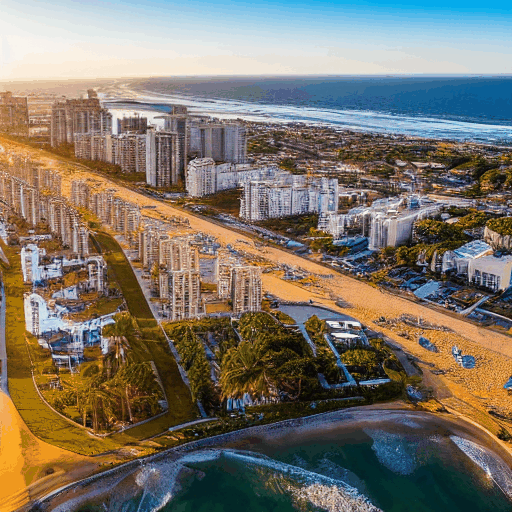
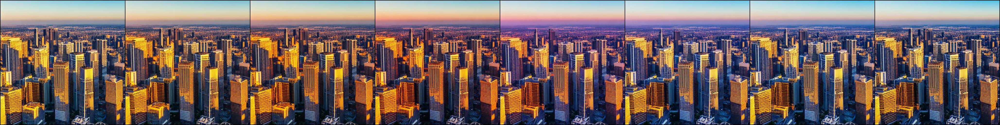
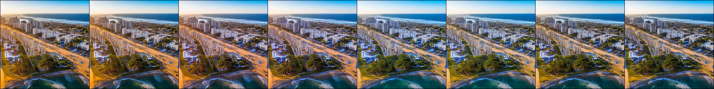
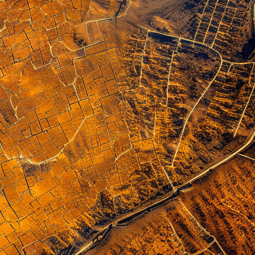
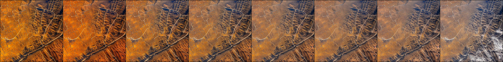
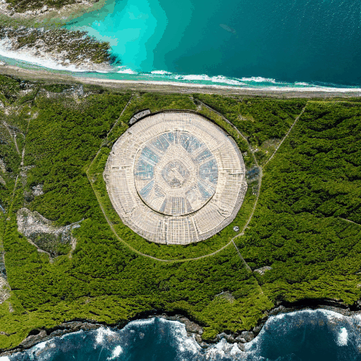
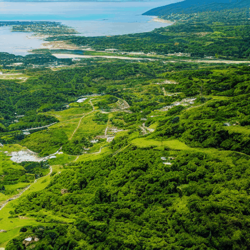
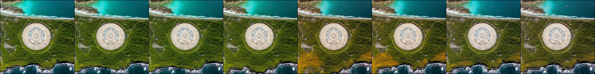
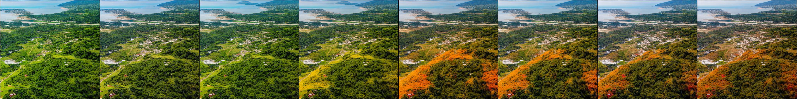

# AeroSTIG

商钰滢，侯英妍*，刘子楠，卢宛萱，黄宇鸿，王逸潇，于泓峰，付琨

此仓库为 **潜在扩散模型驱动的空天时序图像生成方法** 的官方实现。

### 安装要求

```cmd
conda create -n fb python=3.10
conda activate AeroSTIG
pip install -r requirements.txt
```

### 运行

初始视频描述和筛选后的era视频描述已公开在dataset文件夹内。

configs文件夹中已提供三类帧提示文本样例，下附生成结果示例，模型实现代码及全部帧提示数据集将在论文录用后公布。

##### 光照变化

```cmd
python main.py --config dataset/configs/light.yaml
```

            

样例1



样例2



##### 冬季变化

```cmd
python main.py --config dataset/configs/winter.yaml
```

             

样例1



样例2


##### 秋季变化

```
python main.py --config dataset/configs/autumn.yaml
```

              

样例1



样例2


